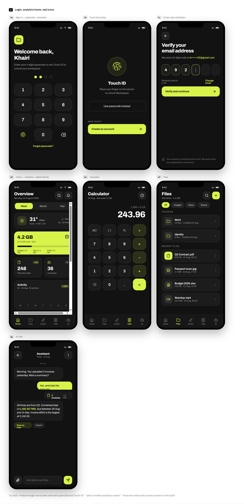

# khairibo

A personal workspace app — files, notes, an AI assistant, and a calculator in one place. Built as an Expo (React Native) mobile app backed by a Next.js API and Supabase (Postgres + Storage).

> **Status:** active development. Auth, files, notes, the AI assistant, weather, and analytics are wired to a real backend and database — no mock data. Document scanning is real OCR text-extraction (not edge-detection/perspective correction — see [Known limitations](#known-limitations)), and Google Drive integration has its database schema in place but no working sync yet.



---

## Contents

- [Features](#features)
- [Tech stack](#tech-stack)
- [Monorepo structure](#monorepo-structure)
- [Prerequisites](#prerequisites)
- [Getting started](#getting-started)
  - [1. Clone and install](#1-clone-and-install)
  - [2. Set up Supabase](#2-set-up-supabase)
  - [3. Configure environment variables](#3-configure-environment-variables)
  - [4. Run the API](#4-run-the-api)
  - [5. Run the mobile app](#5-run-the-mobile-app)
- [Environment variables](#environment-variables)
- [Available scripts](#available-scripts)
- [API reference](#api-reference)
- [Security](#security)
- [Known limitations](#known-limitations)
- [License](#license)

---

## Features

**Auth**
- Passwordless sign-in — a 6-digit code emailed to you, no password to manage. Codes are cryptographically random, hashed at rest, rate-limited (60s cooldown, 5/hour cap), and never logged.
- Local app lock: 4-digit passcode and biometrics (Face ID / Touch ID / fingerprint), independent of the server session.
- Sessions persist securely on-device (refresh token in the OS keychain via `expo-secure-store`); the access token stays in memory only.

**Files**
- Upload documents, photos, and videos from your device's library, or capture a photo directly (which also saves it to your camera roll).
- A real in-app viewer — photos render inline, videos and audio play with native controls, not just a share-sheet hand-off.
- Record audio notes with the device microphone.
- "Scan" captures a photo and runs it through OCR (Claude vision) for real text extraction.
- Folders, favorites, search, and soft-delete.

**Notes, Calculator, AI Assistant**
- Rich note-taking with attachments.
- A fully functional calculator.
- A streaming AI chat assistant, backed by a pluggable provider (Anthropic, OpenRouter, or a self-hosted OpenAI-compatible gateway).

**Home**
- Real-time storage/activity analytics (week/month/year).
- A weather card using your device's actual location (with manual fallback and offline caching) — no hardcoded city.
- An activity feed of what you've actually done in the app.

**Profile**
- Editable display name, real storage usage, change passcode, sign out (revokes the session server-side).

---

## Tech stack

| Layer | Technology |
|---|---|
| Mobile | [Expo](https://expo.dev) (SDK 57) / React Native, Expo Router, React Query, Zustand |
| Backend | [Next.js](https://nextjs.org) (App Router, Route Handlers) |
| Database & Storage | [Supabase](https://supabase.com) (Postgres, Storage, Row Level Security) |
| Validation | [Zod](https://zod.dev) — one shared schema package used by both the API and the mobile client |
| Auth | Custom passwordless email-code flow + JWT (`jose`) — not Supabase Auth sessions |
| AI | Anthropic Claude / OpenRouter / self-hosted OpenAI-compatible gateway (pluggable) |
| Email | Nodemailer (SMTP) or Resend |
| Rate limiting & caching | Upstash Redis |
| Package manager | pnpm workspaces |

## Monorepo structure

```
khairibo/
├── apps/
│   ├── mobile/          # Expo / React Native app
│   │   ├── src/app/     # Expo Router screens (file-based routing)
│   │   ├── src/api/     # Typed fetch clients for the backend
│   │   ├── src/features/# Camera, upload, recording, file actions, etc.
│   │   └── src/stores/  # Zustand session store
│   └── api/              # Next.js backend
│       ├── app/api/      # Route handlers (REST-ish JSON API)
│       ├── lib/           # Auth, email, rate limiting, Supabase admin client
│       ├── providers/     # Pluggable AI and storage provider implementations
│       └── supabase/      # SQL migrations, local Supabase CLI config
└── packages/
    └── shared/            # Zod schemas + types shared by both apps
```

## Prerequisites

- [Node.js](https://nodejs.org) 20+
- [pnpm](https://pnpm.io) 9+ (`corepack enable` is the easiest way to get it)
- A [Supabase](https://supabase.com) account (free tier is enough)
- The [Expo Go](https://expo.dev/go) app on your phone, or an Android/iOS simulator, to run the mobile app
- API keys for whichever optional integrations you want working (AI provider, OpenWeather, SMTP) — the app runs without them, those features just return a clear "not configured" error instead of the account not working at all

## Getting started

### 1. Clone and install

```bash
git clone https://github.com/KHAIRIBO/evday-app.git
cd evday-app
pnpm install
```

### 2. Set up Supabase

1. Create a new project at [supabase.com](https://supabase.com/dashboard).
2. Apply the SQL migrations in [`apps/api/supabase/migrations`](apps/api/supabase/migrations) to your project, in order — either via the Supabase SQL editor (paste each file's contents and run it), or with the [Supabase CLI](https://supabase.com/docs/guides/local-development/cli/getting-started):
   ```bash
   cd apps/api
   supabase link --project-ref <your-project-ref>
   supabase db push
   ```
3. From your project's **Settings → API**, copy the **Project URL** and the **`service_role`** key (not the `anon`/publishable key — the API needs the elevated key since it enforces authorization in application code, not via the client's RLS context). You'll need these in the next step.

### 3. Configure environment variables

Each app has its own `.env.example` — copy it to `.env` and fill in real values. **Never commit `.env` files** (see [Security](#security)).

```bash
cp apps/api/.env.example apps/api/.env
cp apps/mobile/.env.example apps/mobile/.env
```

At minimum, fill in `SUPABASE_URL`, `SUPABASE_SERVICE_ROLE_KEY`, and `JWT_SECRET` in `apps/api/.env` — everything else (AI provider, email, weather) is optional and degrades gracefully. See [Environment variables](#environment-variables) for the full reference.

### 4. Run the API

```bash
pnpm api
```

This starts the Next.js dev server on `http://localhost:3000`. Confirm it's up:

```bash
curl http://localhost:3000/api/health
```

### 5. Run the mobile app

```bash
pnpm mobile
```

Scan the QR code with Expo Go (Android) or the Camera app (iOS), or press `a` / `i` in the terminal for an emulator/simulator.

> **Testing on a physical device?** Set `EXPO_PUBLIC_API_URL` in `apps/mobile/.env` to your computer's **LAN IP**, not `localhost` — on a real device, `localhost` refers to the phone itself, which has nothing listening on port 3000. Find your IP with `ipconfig` (Windows) or `ifconfig`/`ip addr` (macOS/Linux), and make sure your phone and computer are on the same Wi-Fi network. Restart `pnpm mobile` after changing it (`EXPO_PUBLIC_*` variables are baked in at bundle time).

## Environment variables

Full, commented references live in [`apps/api/.env.example`](apps/api/.env.example) and [`apps/mobile/.env.example`](apps/mobile/.env.example) — that's the source of truth. Summary:

**`apps/api/.env`** (server only — never exposed to the client)

| Variable | Required | Purpose |
|---|---|---|
| `SUPABASE_URL`, `SUPABASE_SERVICE_ROLE_KEY` | Yes | Database & storage access |
| `JWT_SECRET` | Yes | Signs this app's own session tokens |
| `AI_PROVIDER` + one of `ANTHROPIC_API_KEY` / `OPENROUTER_API_KEY` / `OMNIROUTE_*` | For AI chat | Picks and configures the AI backend |
| `ANTHROPIC_API_KEY` | For document scan (OCR) | Used independently of `AI_PROVIDER` |
| `KP_SMTP_*` or `RESEND_API_KEY` | For real emails | Sends verification codes (falls back to a console log outside production) |
| `OPENWEATHER_API_KEY` | For the weather card | Free tier at openweathermap.org |
| `UPSTASH_REDIS_REST_URL/TOKEN` | Recommended | Rate limiting & weather caching |

**`apps/mobile/.env`** (public — bundled into the app)

| Variable | Required | Purpose |
|---|---|---|
| `EXPO_PUBLIC_API_URL` | Yes | Base URL of the API this app talks to |

## Available scripts

Run from the repo root:

| Command | Description |
|---|---|
| `pnpm mobile` | Start the Expo dev server |
| `pnpm mobile:web` / `pnpm mobile:android` / `pnpm mobile:ios` | Start on a specific platform |
| `pnpm api` | Start the Next.js API dev server |
| `pnpm lint` | Lint every package in the workspace |

## API reference

All routes are under `apps/api/app/api/`, mounted at `/api/*`. Every route that isn't `auth/*` or `health` requires a `Bearer` access token.

| Route | Purpose |
|---|---|
| `POST /api/auth/register`, `/login` | Request a sign-in code (idempotent — creates the account if it doesn't exist) |
| `POST /api/auth/verify-email` | Redeem a code for an access + refresh token pair |
| `POST /api/auth/refresh`, `/logout` | Session management |
| `GET/POST /api/files`, `/api/files/[id]`, `/upload-url`, `/signed-url` | File CRUD and direct-to-storage uploads |
| `GET/POST /api/folders`, `/api/folders/[id]` | Folder CRUD |
| `GET/POST /api/notes`, `/api/notes/[id]` | Note CRUD |
| `POST /api/ocr/process` | Run OCR on an uploaded image |
| `GET/POST /api/assistant/conversations`, `.../messages` | AI chat, with streaming responses |
| `GET /api/analytics/summary` | Storage/file/AI usage stats |
| `GET /api/activity` | Recent activity log |
| `GET /api/weather` | Weather by lat/lon or city, server-side cached |
| `GET /api/profile`, `PATCH /api/profile` | Profile read/update |
| `GET /api/health` | Liveness check |

## Security

This repository is audited to be safe to publish publicly:

- No `.env` file, API key, database password, or connection string is tracked by git, in the current tree **or** anywhere in git history.
- All secrets are read from environment variables at runtime (`process.env.*`) — there are no hardcoded fallback credentials anywhere in the source.
- `.gitignore` blocks every `.env*` variant (except `.env.example`, which contains placeholders only) plus common credential file types (`*.pem`, `*.key`, `*.crt`, mobile signing files).
- `apps/api/supabase/config.toml` (the Supabase CLI's local config) uses `env(...)` references for anything sensitive, as generated by `supabase init` — it holds no real values.

If you fork or clone this repo and configure it with real credentials, remember:
- Never commit your `.env` files.
- If a real secret is *ever* accidentally committed, removing it in a later commit **does not undo the exposure** — it's still visible in git history to anyone who cloned the repo before, and to anyone who digs through history after. Rotate/revoke the credential immediately at its source (Supabase, your email provider, your AI provider, etc.), then remove it from history if the repo is or was public.
- Treat the Supabase `service_role` key like a root password — it bypasses Row Level Security entirely and belongs only in `apps/api/.env`, never in the mobile app or any client-exposed code.

## Known limitations

Documented honestly rather than left for you to discover:

- **Document "scanning"** captures a photo and runs OCR text extraction on it (Claude vision) — there's no page-edge detection or perspective correction. Expo has no built-in document scanner, and the real community options require a custom native build (EAS dev client), not Expo Go.
- **Google Drive integration** has its database schema in place (`integrations`, `google_drive_accounts` tables) but no OAuth flow or sync logic implemented yet.
- **In-app file preview** supports images, video, and audio. Other file types (PDFs, spreadsheets, etc.) fall back to "open with another app" rather than an in-app renderer.
- The AI provider registry currently implements Anthropic, OpenRouter, and a self-hosted OpenAI-compatible gateway ("OmniRoute"); OpenAI and Gemini are placeholders for future work.

## License

[MIT](LICENSE)
